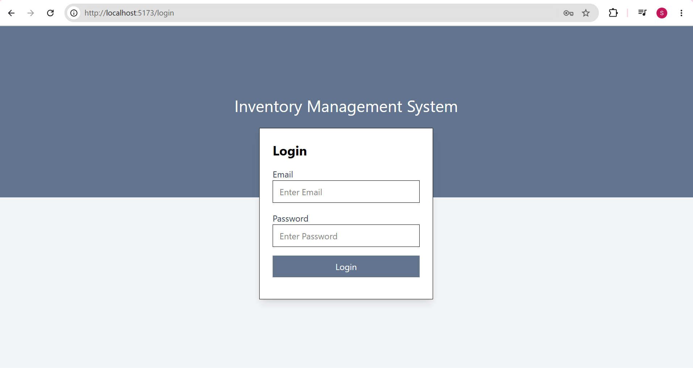

# Smart Inventory Management System

A full-stack **Smart Inventory Management System** developed to efficiently manage products, categories, suppliers, customers, users, orders, and inventory.

## Features

* User authentication and authorization
* Admin dashboard
* Product management
* Category management
* Supplier management
* User management
* Customer product management
* Order management
* Product search and filtering
* Inventory and stock management
* Responsive user interface

## Technologies Used

### Frontend

* React.js
* JavaScript
* HTML5
* CSS3
* Axios
* React Router

### Backend

* Node.js
* Express.js
* MongoDB
* Mongoose

## Project Structure

```text
Smart-Inventory-Management-System/
│
├── frontend/
│   ├── public/
│   │
│   ├── src/
│   │   ├── components/
│   │   │   ├── Categories.jsx
│   │   │   ├── Suppliers.jsx
│   │   │   ├── Products.jsx
│   │   │   ├── Users.jsx
│   │   │   ├── Orders.jsx
│   │   │   ├── Profile.jsx
│   │   │   └── CustomerProducts.jsx
│   │   │
│   │   ├── pages/
│   │   │   ├── Login.jsx
│   │   │   └── Dashboard.jsx
│   │   │
│   │   ├── utils/
│   │   │   ├── Root.jsx
│   │   │   └── ProtectedRoutes.jsx
│   │   │
│   │   ├── App.jsx
│   │   ├── App.css
│   │   └── main.jsx
│   │
│   ├── package.json
│   └── vite.config.js
│
├── server/
│   ├── controllers/
│   │   ├── authController.js
│   │   ├── categoryController.js
│   │   ├── supplierController.js
│   │   ├── productController.js
│   │   ├── userController.js
│   │   ├── orderController.js
│   │   └── dashboardController.js
│   │
│   ├── models/
│   │   ├── User.js
│   │   ├── Product.js
│   │   ├── Category.js
│   │   ├── Supplier.js
│   │   └── Order.js
│   │
│   ├── routes/
│   │   ├── auth.js
│   │   ├── category.js
│   │   ├── supplier.js
│   │   ├── product.js
│   │   ├── user.js
│   │   └── order.js
│   │
│   ├── middleware/
│   │   └── authMiddleware.js
│   │
│   ├── db/
│   │   └── connection.js
│   │
│   ├── index.js
│   └── package.json
```

## Screenshots

### Login Page



### Admin Dashboard


### Products Management


### Categories Management


### Suppliers Management


## How to Run the Project

### Prerequisites

Make sure the following are installed:

* Node.js
* npm
* MongoDB
* Git

### 1. Clone the Repository

```bash
git clone YOUR_GITHUB_REPOSITORY_URL
```

### 2. Navigate to the Project

```bash
cd Smart-Inventory-Management-System
```

### 3. Install Frontend Dependencies

```bash
cd frontend
npm install
```

### 4. Start the Frontend

```bash
npm run dev
```

The frontend will run on:

```text
http://localhost:5173
```

### 5. Install Backend Dependencies

Open a new terminal:

```bash
cd server
npm install
```

### 6. Start the Backend

```bash
npm run dev
```

## Environment Variables

Create a `.env` file inside the `server` folder and add your MongoDB connection string.

Example:

```env
MONGO_URI=your_mongodb_connection_string
PORT=3000
```

**Do not upload your `.env` file to GitHub.**

## Main Modules

### Admin Dashboard

* Total products
* Total stock
* Today's orders
* Revenue
* Out-of-stock products
* Low-stock products
* Highest-selling products

### Product Management

* Add products
* Edit products
* Delete products
* Manage stock
* Assign categories
* Assign suppliers

### Category Management

* Add categories
* Edit categories
* Delete categories

### Supplier Management

* Add suppliers
* Edit suppliers
* Delete suppliers
* Manage supplier details

### Order Management

* Create orders
* View orders
* Manage product quantities
* Automatically update inventory stock

### User Management

* Add users
* View users
* Delete users
* Manage user information

## Future Enhancements

* Online payment integration
* Advanced sales reports
* Inventory notifications
* Email notifications
* Role-based access improvements
* Cloud deployment

## Author

**Sujha Telukala**

